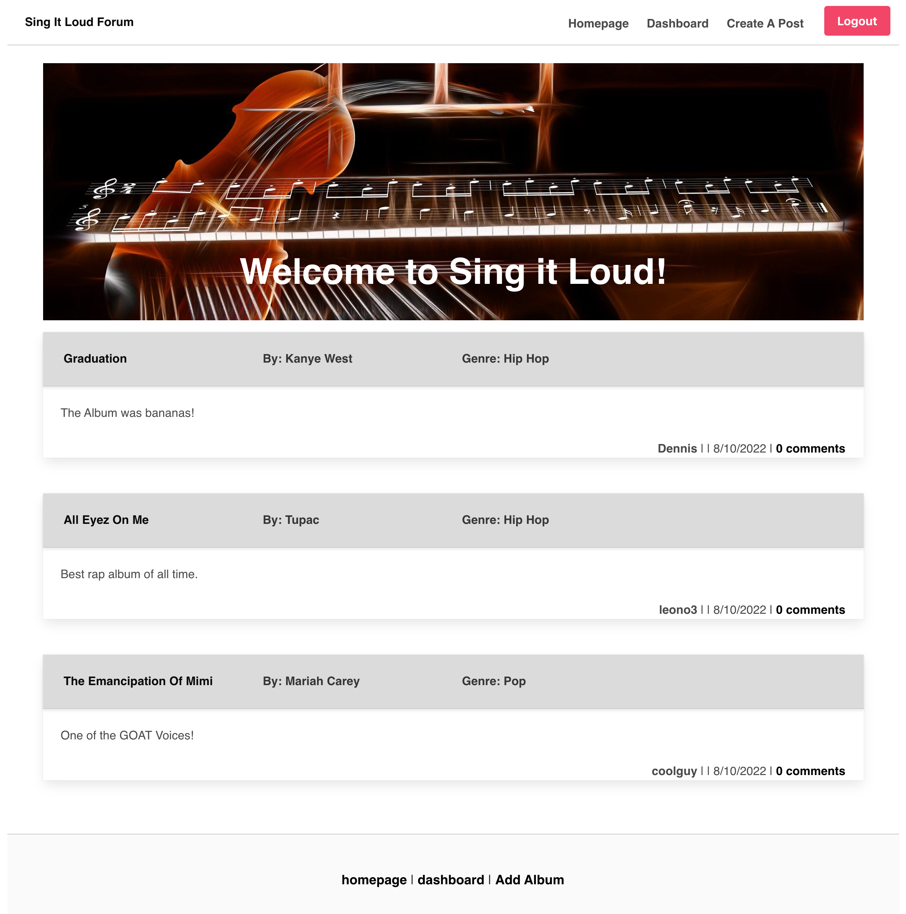
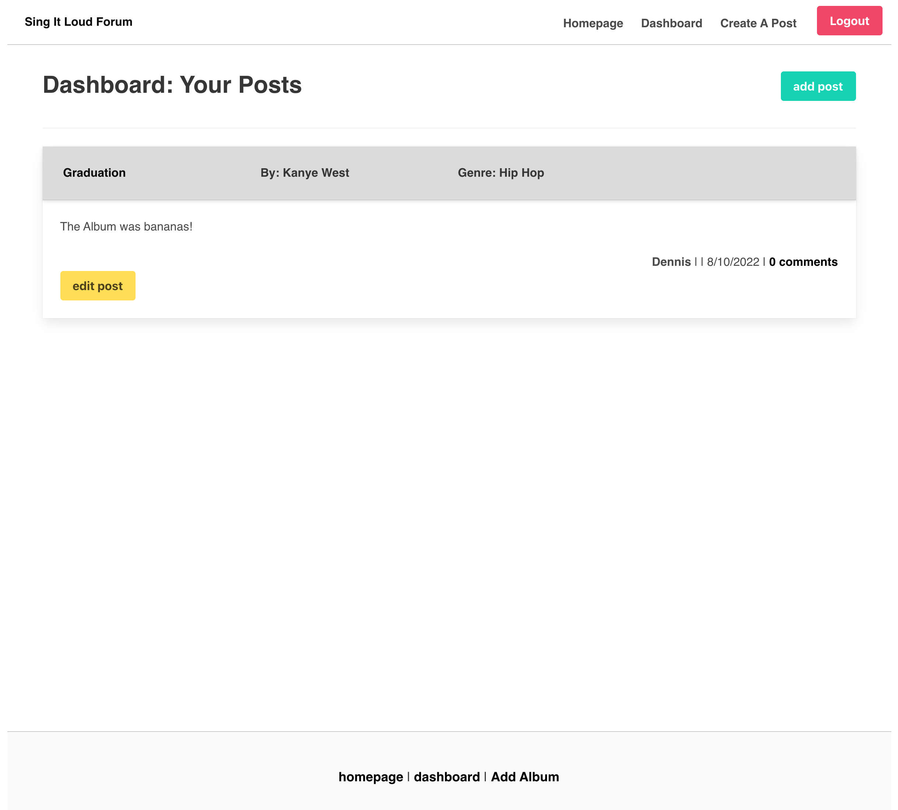

# Pokemon Battle!

## Table of contents

- [Overview](#overview)
  - [The challenge](#the-challenge)
  - [User Story](#user-story)
  - [Acceptance Criteria](#acceptance-criteria)
  - [Links](#links)
- [Installation](#installation)
- [Process](#process)
  - [Built with](#built-with)
  - [What was learned](#what-i-learned)

## Overview

### The challenge

Collaborate with fellow developers to build a full-stack application that is interactive (i.e: accept and respond to user input) and utilizes a database to store inputs. The application will be live and deployed to Heroku.
Use Node.js and Express.js to create a RESTful API.

Use Handlebars.js as the templating engine.

Use MySQL and the Sequelize ORM for the database.

Have both GET and POST routes for retrieving and adding new data.

Be deployed using Heroku (with data).

Use at least one new library, package, or technology that we haven’t discussed.

Have a polished UI.

Be responsive.

Be interactive (i.e., accept and respond to user input).

Have a folder structure that meets the MVC paradigm.

Include authentication (express-session and cookies).

Protect API keys and sensitive information with environment variables.

Have a clean repository that meets quality coding standards (file structure, naming conventions, follows best practices for class/id naming conventions, indentation, quality comments, etc.).

Have a quality README (with unique name, description, technologies used, screenshot, and link to deployed application).

### User Story

    AS A music enthusiast 
    I WANT to be able to discuss music albums with friends
    SO THAT I can have fun and learn

### Acceptance Criteria
    Use Node.js and Express.js to create a RESTful API.

    Use Handlebars.js as the templating engine.

    Use MySQL and the Sequelize ORM for the database.

    Have both GET and POST routes for retrieving and adding new data.

    Be deployed using Heroku (with data).

    Use at least one new library, package, or technology that we haven’t discussed.

    Have a polished UI.

    Be responsive.

    Be interactive (i.e., accept and respond to user input).

    Have a folder structure that meets the MVC paradigm.

    Include authentication (express-session and cookies).

    Protect API keys and sensitive information with environment variables.

    Have a clean repository that meets quality coding standards (file structure, naming conventions, follows best practices for class/id naming conventions, indentation, quality comments, etc.).

    Have a quality README (with unique name, description, technologies used, screenshot, and link to deployed application).

## Installation
  This app was developed and tested using MySQL. Please refer to: [MySQL documentation](https://dev.mysql.com/doc/mysql-installation-excerpt/5.7/en/)
  
  You’ll need to use the MySQL2 and Sequelize packages to connect your Express.js API to a MySQL database and the dotenv package to use environment variables to store sensitive data, like your MySQL username, password, and database name.
  Use the schema.sql file in the db folder to create your database using MySQL shell commands. Use environment variables to store sensitive data, like your MySQL username, password, and database name.

    
    - Clone the repo
    - 'npm i'
    - source schema.sql to create database
    
### Screenshot

### Links

- [Github URL here](https://github.com/dnsnguy08/sing_it_loud)
- [Live webpage URL](https://sing-it-loud.herokuapp.com/)

## Process

### Built with
- HTML
- CSS
- Javascript
- MySQL
- Sequelize.js
- Handlebars.js for templating
- [Bulma](https://bulma.io/documentation/)
- [Heroku](https://id.heroku.com/)
### What was learned
The team was able to work colloboratively in an AGILE scrum setting and work towards the goal in a sprint (2-week) timeline. Front-end and back-end skills were used to develop dynamic features on the page; such as utilizing a database for user inputs, deployment of a live server, and responsive front-end devlopment. 

## License
MIT License

Copyright (c) [2022] [Dennis Nguyen](https://github.com/dnsnguy08), [Leo Ho](), [Justin Yang]()

Permission is hereby granted, free of charge, to any person obtaining a copy
of this software and associated documentation files (the "Software"), to deal
in the Software without restriction, including without limitation the rights
to use, copy, modify, merge, publish, distribute, sublicense, and/or sell
copies of the Software, and to permit persons to whom the Software is
furnished to do so, subject to the following conditions:

The above copyright notice and this permission notice shall be included in all
copies or substantial portions of the Software.

THE SOFTWARE IS PROVIDED "AS IS", WITHOUT WARRANTY OF ANY KIND, EXPRESS OR
IMPLIED, INCLUDING BUT NOT LIMITED TO THE WARRANTIES OF MERCHANTABILITY,
FITNESS FOR A PARTICULAR PURPOSE AND NONINFRINGEMENT. IN NO EVENT SHALL THE
AUTHORS OR COPYRIGHT HOLDERS BE LIABLE FOR ANY CLAIM, DAMAGES OR OTHER
LIABILITY, WHETHER IN AN ACTION OF CONTRACT, TORT OR OTHERWISE, ARISING FROM,
OUT OF OR IN CONNECTION WITH THE SOFTWARE OR THE USE OR OTHER DEALINGS IN THE
SOFTWARE.
